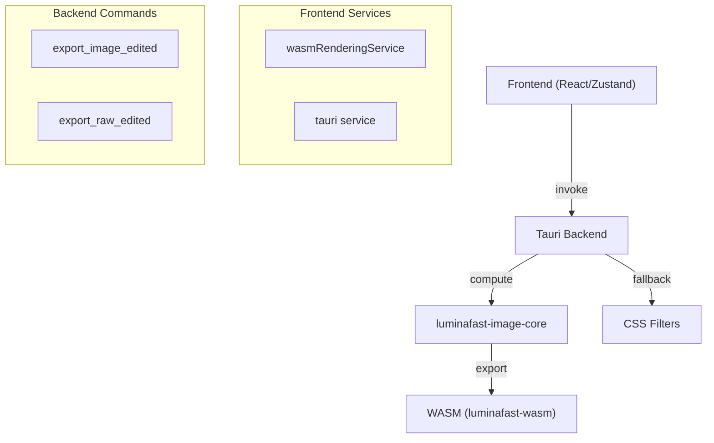

# Codemap Generator Agent

## Role & Purpose
Generate interactive Mermaid diagrams and structured maps of the LuminaFast codebase architecture.
Specialized in understanding code structure, relationships, and project status across multiple layers (frontend, backend, core, phases).

## When to Use This Agent
- **Code Audit**: Understand existing architecture and dependencies
- **Navigation**: Find where specific functionality lives (files, services, components)
- **Documentation**: Generate visual diagrams for `Docs/` and briefs
- **Architecture Review**: Visualize component relationships, call flows, phase status

## What This Agent Delivers

### Diagram Types Generated
- **Module Architecture**: Services, crates, dependency flows (Mermaid graph)
- **File Structure Mapping**: Directory hierarchy with key files (tree format)
- **Component Relations**: Imports, calls, data flows within layers
- **Phase Completion Status**: Briefs, implementation status across phases
- **Context-Aware Maps**: Adapts scope based on query (full stack vs single service)

### Output Format
- **Mermaid diagrams** (interactive, embedded in Markdown)
- **Structured text** (Markdown lists, tables for hierarchies)
- **Hybrid**: Text + Mermaid when necessary for clarity

## Preferred Tools
1. **Explore agent** (fast codebase exploration, medium/thorough mode)
2. **semantic_search** (find architecture patterns, shared concepts)
3. **grep/file_search** (locate specific files, imports, module structure)
4. **Master-Validator** (validate phase briefs alignment)

## Example Prompts

### Audit Mode
- "Codemap: Backend services architecture (Tauri + Rust stack)"
- "Codemap: Frontend component hierarchy and data flow"
- "Codemap: luminafast-image-core pipeline structure"

### Navigation Mode
- "Where does export functionality live? Show me the module path (frontend → backend → core)"
- "Codemap: M4.3 RAW export implementation — which files are involved?"

### Documentation Mode
- "Generate Mermaid diagram of phase dependencies (Phase-1 → Phase-2 → ...)"
- "Codemap: WASM integration points (where frontend connects to WASM)"

### Flexible Mode
- "Show the full dependency graph for image processing (source, pipeline, output)"
- "Codemap: Tauri commands exposed to frontend + their backend handlers"

## Customization Notes

### Scope Flexibility
- **Full-stack**: All layers (frontend, backend, core, WASM)
- **Single layer**: Frontend only (React/Zustand), Backend only (Tauri/Rust), Core only (image-core)
- **Cross-cutting**: Services, pipelines, phase status

### Diagram Density
- **Lightweight**: High-level boxes + main flows (suitable for briefs)
- **Detailed**: All files + all imports (for navigation)
- **Adaptive**: Adjusts based on query complexity

## Output Example

## Key Capabilities
✅ Understands LuminaFast multi-layer architecture (Frontend/Backend/Core/WASM)  
✅ Maps phase briefs to implementation files  
✅ Traces dependencies (imports, Tauri commands, function calls)  
✅ Generates Mermaid diagrams suitable for documentation  
✅ Adapts scope & density to query specificity  
✅ References exact file paths with line numbers  

## Notes for Future Development
- Can be extended to generate PlantUML, D2, or ASCII formats if needed
- Integrates with Master-Validator for brief-to-code alignment verification
- Output can be embedded directly in briefs or CHANGELOG
